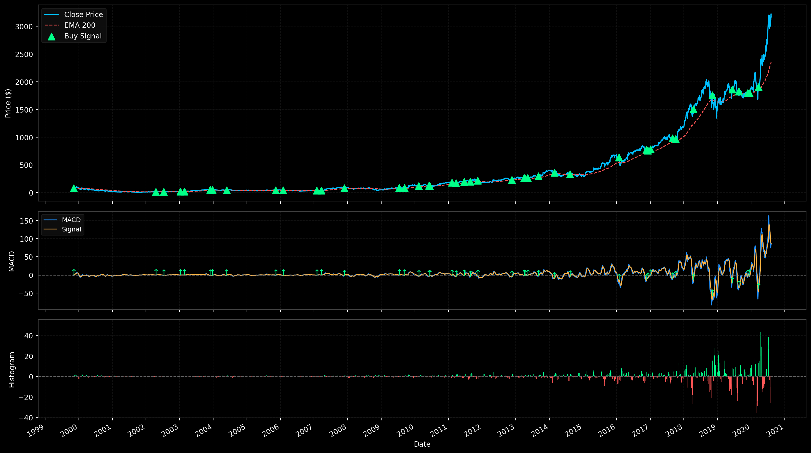
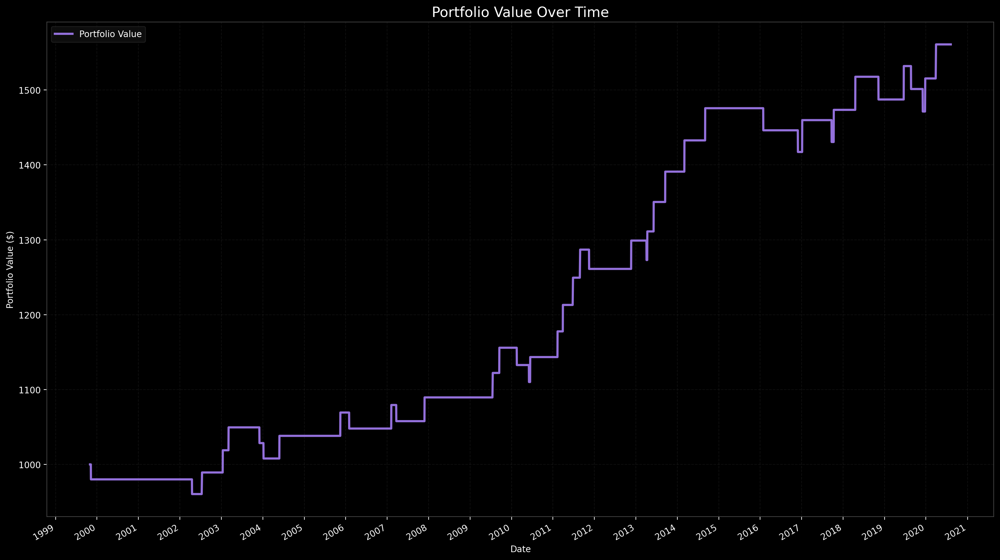

# MACD Trading Strategy Validation

This project tests and validates a **MACD-based trading strategy** using historical stock data (example: `AMZN_daily.csv`).

The strategy uses:
- 12-day and 26-day exponential moving averages (EMAs)
- A 9-day signal line
- A 200-day EMA to determine long-term trend direction

A buy signal occurs when:
- MACD histogram crosses from negative to positive,
- both MACD and Signal are below zero, and
- the trend is upward (price > EMA200).

Each trade applies basic risk management with:
- Stop loss: 2%
- Take profit: 3% (1.5× risk)

---
## Related Video

Watch the full breakdown on YouTube:  
[Losing Loonies YouTube Channel](https://www.youtube.com/@LosingLoonies)
[Losing Loonies Patreon](https://www.patreon.com/c/LosingLoonies)

## Portfolio Simulation

The script simulates an initial portfolio of **$1000**, applying the strategy over time.
Each trade outcome (win or loss) affects the portfolio’s value.

At the end, the script prints:
- Total accuracy (percentage of winning trades)
- Portfolio performance over time

---

## Results

Below are the generated results from the simulation.

### Figure 1 — Trading Strategy Visualization
Shows:
- Price vs EMA200
- MACD and Signal lines
- Histogram and buy points

---

### Figure 2 — Portfolio Value Over Time
Shows:
- Portfolio growth (or decline) over time
- Each trade’s cumulative effect on total value

---

